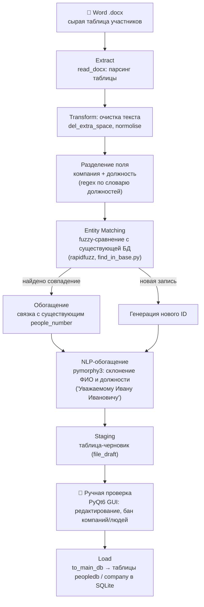
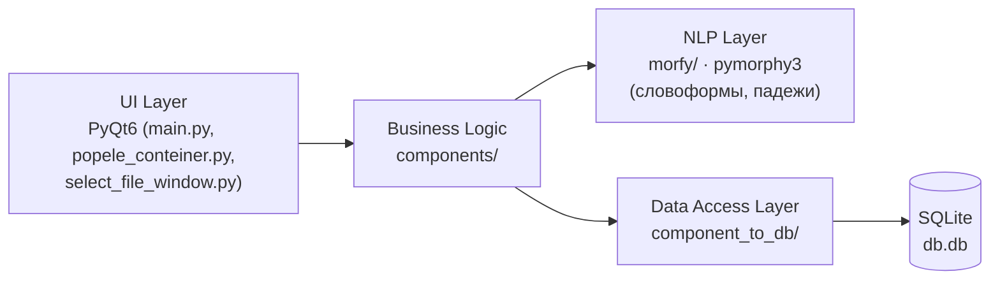

# ELT Pipeline: обработка контактов участников конференций

Настольное приложение (Python + PyQt6), которое превращает неструктурированные списки участников конференций из Word-документов в очищенные, дедуплицированные записи в базе контактов.

## Проблема

После конференций организаторы получают списки участников в виде Word-таблиц: одна ячейка содержит слитно название компании и должность (`ООО «Вектор Софт» Исполнительный директор — руководитель департамента ИТ`), телефон и email не разделены, ФИО в разных падежах, компании пишутся по-разному (`ООО`, `Общество с ограниченной ответственностью`, с кавычками и без). Нужно превратить это в структурированные, проверенные и не дублирующиеся записи в единой базе контактов.

## Архитектура

Проект реализует классический **ELT**-подход (Extract → Load into staging → Transform/enrich → Load into curated storage), обёрнутый в GUI для ручной валидации перед финальной загрузкой.



### Слои приложения



## Как работает entity matching (ключевая часть пайплайна)

Самая нетривиальная задача — понять, что `ООО «Аркадия»` и `Общество с ограниченной ответственностью «Аркадия»` — одна и та же компания, а `Козлов Андрей Николаевич` из строки 20 и строки 21 — один и тот же человек (см. тестовый файл, записи дублируются намеренно для проверки дедупликации).

Логика в `components/find_in_base.py`:

1. **Нормализация** — приведение к нижнему регистру, замена длинных юридических форм на короткие (`общество с ограниченной ответственностью` → `ооо`), удаление кавычек-ёлочек и лишних пробелов.
2. **Быстрая проверка** — `rapidfuzz.token_set_ratio` с порогом 85.
3. **Фолбэк для организационных форм** — сравнение по ключевым словам длиннее 3 символов после удаления юр. формы (`strip_legal`), чтобы отличать `ООО Ромашка` от `АО Ромашка Плюс`.
4. **Фолбэк для аббревиатур** — сопоставление вида `вектор софт` ↔ `вектор сс` (по первым буквам слов).
5. Отдельно для ФИО — `token_sort_ratio`, чтобы не зависеть от порядка слов (Фамилия Имя Отчество / Имя Отчество Фамилия).

## Структура проекта

```
.
├── main.py                    # точка входа GUI, MainWindow
├── main_function.py           # оркестрация: чтение docx → трансформация → сборка записи
├── run.py                     # запуск приложения, выбор режима (новый файл / черновик)
├── select_file_window.py      # окно выбора исходного .docx
├── popele_conteiner.py        # виджет карточки одного контакта
├── requirements.txt
├── components/                 # бизнес-логика / ELT-ядро
│   ├── del_space.py            # очистка текста
│   ├── emaildetector.py        # regex-извлечение email
│   ├── phonedetector.py        # regex-извлечение телефона
│   ├── find_in_base.py         # fuzzy entity matching (компании, ФИО)
│   ├── to_norm_vid.py          # нормализация написания компании
│   ├── all_first_word.py       # словарь должностей для разбиения "компания+должность"
│   ├── fromactdb.py            # догрузка словаря должностей из текущей БД
│   ├── sklonenie.py            # склонение слов по падежам (pymorphy3)
│   ├── name_lastname.py        # обращение "Уважаемый(ая) Имя Отчество"
│   └── to_main_db.py           # Load: запись финальных данных в основную БД
├── component_to_db/            # доступ к данным (staging + curated)
├── morfy/                      # NLP-обёртки над pymorphy3
├── ui/                         # сгенерированные PyQt6-формы и стили
├── settings/                   # локальные настройки приложения
└── tests/
    └── fixtures/
        └── тестовые_данные_20_записей_все_формы_юрлиц.docx
```

## Тестовые данные

В `tests/fixtures/` лежит синтетический файл `тестовые_данные_20_записей_все_формы_юрлиц.docx` — 20+ вымышленных контактов, покрывающих основные edge cases пайплайна:

| Кейс | Пример из файла |
|---|---|
| Разные формы юрлица для одной компании | `ООО «Аркадия»` / `Общество с ограниченной ответственностью «Аркадия»` (строки 16, 18) |
| Точный дубль контакта | Козлов А.Н. — строки 20 и 21, идентичны кроме телефона |
| Длинные составные должности | «Первый заместитель генерального директора по финансам и экономике» |
| Разные типы юр. форм | ООО, АО, ПАО, Акционерное Общество (полное написание) |
| Слипшиеся телефон/email без пробела | `+7 999 580 72 16ngromov@example.com` |

Все ФИО, компании и email в файле полностью вымышлены (домен `example.com`) и созданы специально для тестирования — реальные данные из проекта в репозиторий не включены (см. `.gitignore`).

## Технологический стек

| Библиотека | Назначение |
|---|---|
| `PyQt6` | графический интерфейс |
| `python-docx` | извлечение таблиц из Word |
| `pymorphy3` + `pymorphy3-dicts-ru` | морфологический анализ и склонение русских слов |
| `rapidfuzz` | нечёткое сравнение строк (entity resolution) |
| `pandas` | вспомогательная обработка данных |
| `sqlite3` | хранилище (staging + curated) |

## Установка и запуск

```bash
pip install -r requirements.txt
python run.py
```

## Известные ограничения и планы по развитию

- `check_in_data` в `find_in_base.py` перебирает все записи БД в Python (O(n) на каждую проверку) — при росте базы стоит заменить на blocking-стратегию (предфильтр по первой букве/токену) перед fuzzy-сравнением, либо перейти на Postgres с `pg_trgm`.
- Соединение с SQLite сейчас открывается на уровне модуля — стоит обернуть в контекстный менеджер.
- Нет автотестов на функции нормализации/матчинга — это ближайший TODO, так как именно эта логика наиболее подвержена регрессиям.